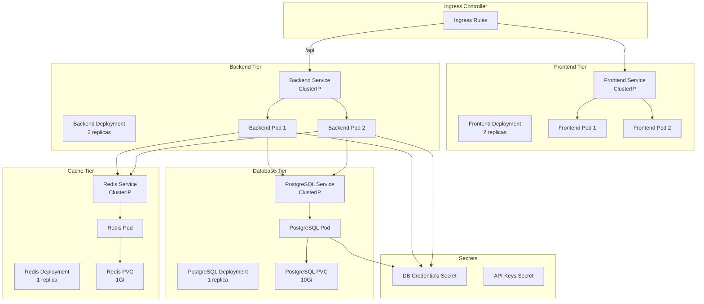

# Kubernetes Architecture Documentation

## Overview

This document describes the Kubernetes architecture for deploying the finch-frontend and finch-backend applications along with supporting services (PostgreSQL and Redis) in a Kubernetes cluster.

## Architecture Diagram



## Component Overview

### Frontend Deployment

**File**: `kubernetes/frontend-deployment.yaml`

- **Replicas**: 2
- **Image**: finch-frontend (from Docker Hub)
- **Resources**:
  - Requests: CPU 100m, Memory 128Mi
  - Limits: CPU 200m, Memory 256Mi
- **Port**: 80
- **Health Checks**: Liveness and readiness probes on `/`
- **Service Type**: ClusterIP

### Backend Deployment

**File**: `kubernetes/backend-deployment.yaml`

- **Replicas**: 2
- **Image**: finch-backend (from Docker Hub)
- **Resources**:
  - Requests: CPU 250m, Memory 256Mi
  - Limits: CPU 500m, Memory 512Mi
- **Port**: 3000
- **Health Checks**: Liveness and readiness probes on `/health`
- **Service Type**: ClusterIP
- **Environment Variables**: Database URL, Redis URL, Frontend URL

### PostgreSQL Deployment

**File**: `kubernetes/postgresql-deployment.yaml`

- **Replicas**: 1
- **Image**: postgres:15-alpine
- **Resources**:
  - Requests: CPU 250m, Memory 256Mi
  - Limits: CPU 500m, Memory 512Mi
- **Port**: 5432
- **Storage**: 10Gi Persistent Volume Claim
- **Service Type**: ClusterIP
- **Credentials**: From Kubernetes Secret

### Redis Deployment

**File**: `kubernetes/redis-deployment.yaml`

- **Replicas**: 1
- **Image**: redis:7-alpine
- **Resources**:
  - Requests: CPU 100m, Memory 128Mi
  - Limits: CPU 200m, Memory 256Mi
- **Port**: 6379
- **Storage**: 1Gi Persistent Volume Claim
- **Service Type**: ClusterIP
- **Persistence**: AOF (Append Only File) enabled

### Ingress

**File**: `kubernetes/ingress.yaml`

- **Ingress Class**: nginx
- **Host**: finch.local (configurable)
- **Routes**:
  - `/` → Frontend Service (port 80)
  - `/api` → Backend Service (port 3000)
- **TLS**: Optional (commented out for local development)

## Resource Allocation

### CPU and Memory Limits

| Component | CPU Request | CPU Limit | Memory Request | Memory Limit |
|-----------|-------------|-----------|----------------|--------------|
| Frontend   | 100m        | 200m      | 128Mi          | 256Mi        |
| Backend    | 250m        | 500m      | 256Mi          | 512Mi        |
| PostgreSQL | 250m        | 500m      | 256Mi          | 512Mi        |
| Redis      | 100m        | 200m      | 128Mi          | 256Mi        |

### Storage

- **PostgreSQL**: 10Gi persistent volume
- **Redis**: 1Gi persistent volume

## Scaling Strategies

### Horizontal Pod Autoscaling (HPA)

For production, consider implementing HPA based on CPU and memory usage:

```yaml
apiVersion: autoscaling/v2
kind: HorizontalPodAutoscaler
metadata:
  name: finch-backend-hpa
spec:
  scaleTargetRef:
    apiVersion: apps/v1
    kind: Deployment
    name: finch-backend
  minReplicas: 2
  maxReplicas: 10
  metrics:
  - type: Resource
    resource:
      name: cpu
      target:
        type: Utilization
        averageUtilization: 70
  - type: Resource
    resource:
      name: memory
      target:
        type: Utilization
        averageUtilization: 80
```

### Vertical Pod Autoscaling (VPA)

VPA can automatically adjust resource requests and limits based on historical usage patterns.

### Manual Scaling

Scale deployments manually:

```bash
kubectl scale deployment finch-frontend --replicas=3
kubectl scale deployment finch-backend --replicas=5
```

## Network Architecture

### Service Discovery

Services communicate using Kubernetes DNS:
- Frontend → Backend: `http://finch-backend-service:3000`
- Backend → PostgreSQL: `finch-postgresql-service:5432`
- Backend → Redis: `finch-redis-service:6379`

### Ingress Routing

- External traffic → Ingress Controller
- Ingress Controller routes:
  - `/` → Frontend Service
  - `/api/*` → Backend Service

## Health Checks

### Liveness Probes

Ensure containers are running and restart if unhealthy:
- **Frontend**: HTTP GET on `/` every 10s
- **Backend**: HTTP GET on `/health` every 10s
- **PostgreSQL**: `pg_isready` command every 10s
- **Redis**: `redis-cli ping` every 10s

### Readiness Probes

Determine when containers are ready to accept traffic:
- **Frontend**: HTTP GET on `/` every 5s
- **Backend**: HTTP GET on `/health` every 5s
- **PostgreSQL**: `pg_isready` command every 5s
- **Redis**: `redis-cli ping` every 5s

## Persistent Storage

### Storage Classes

Manifests use `standard` storage class. For production:
- Use appropriate storage class for your cluster
- Consider SSD storage for databases
- Implement backup strategies

### Volume Claims

- **PostgreSQL PVC**: 10Gi for database data
- **Redis PVC**: 1Gi for AOF persistence

## Deployment Strategy

### Rolling Updates

Default Kubernetes strategy:
- Gradually replaces old pods with new ones
- Maintains service availability
- Allows rollback if issues occur

### Blue-Green Deployment

For zero-downtime deployments:
1. Deploy new version alongside old
2. Test new version
3. Switch traffic to new version
4. Remove old version

### Canary Deployment

Gradually roll out new version:
1. Deploy new version to small percentage
2. Monitor metrics
3. Gradually increase percentage
4. Full rollout if successful

## Security Considerations

1. **Network Policies**: Restrict pod-to-pod communication
2. **RBAC**: Limit service account permissions
3. **Secrets Management**: Use Kubernetes Secrets or external secret managers
4. **Image Security**: Scan images for vulnerabilities
5. **Pod Security**: Run as non-root users
6. **TLS**: Enable TLS for ingress in production

## Local Development Setup

### Prerequisites

- Kubernetes cluster (minikube, kind, or cloud)
- kubectl configured
- Docker images built and pushed to registry

### Deployment Steps

1. **Create secrets**:
   ```bash
   kubectl apply -f kubernetes/secrets/
   ```

2. **Deploy databases**:
   ```bash
   kubectl apply -f kubernetes/postgresql-deployment.yaml
   kubectl apply -f kubernetes/redis-deployment.yaml
   ```

3. **Deploy applications**:
   ```bash
   kubectl apply -f kubernetes/backend-deployment.yaml
   kubectl apply -f kubernetes/frontend-deployment.yaml
   ```

4. **Deploy ingress**:
   ```bash
   kubectl apply -f kubernetes/ingress.yaml
   ```

5. **Verify deployment**:
   ```bash
   kubectl get pods
   kubectl get services
   kubectl get ingress
   ```

### Accessing the Application

For local development with minikube:
```bash
# Enable ingress addon
minikube addons enable ingress

# Get ingress IP
minikube ip

# Add to /etc/hosts
echo "$(minikube ip) finch.local" | sudo tee -a /etc/hosts

# Access application
curl http://finch.local
```

## Monitoring Integration

The architecture is designed to work with:
- **Prometheus**: Scrapes metrics from all pods
- **Loki**: Collects logs from all pods
- **Grafana**: Visualizes metrics and logs

See `Monitoring_Setup.md` for details.

## Troubleshooting

### Common Issues

1. **Pods not starting**
   - Check pod logs: `kubectl logs <pod-name>`
   - Verify image exists and is accessible
   - Check resource limits

2. **Services not accessible**
   - Verify service selectors match pod labels
   - Check service endpoints: `kubectl get endpoints`

3. **Database connection fails**
   - Verify secrets are created
   - Check service DNS resolution
   - Verify network policies allow traffic

4. **Ingress not working**
   - Verify ingress controller is installed
   - Check ingress class configuration
   - Verify host DNS resolution

## Next Steps

1. Implement HPA for automatic scaling
2. Set up network policies
3. Configure TLS certificates
4. Implement backup strategies
5. Set up monitoring and alerting
6. Configure resource quotas
7. Implement pod disruption budgets
